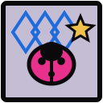

<div align="center">



# antd-jojo-theme

[](https://clawd-cook.github.io/antd-jojo-theme/)
[](https://www.npmjs.com/package/@clawd-cook/antd-jojo-theme)
[](https://nodejs.org)
[](https://www.typescriptlang.org)
[](LICENSE)

Ant Design theme anchored to _JoJo’s Bizarre Adventure_ **Part 5 — Vento Aureo / Golden Wind**:
Passione pink, antique gold, ladybug fabric, jewelry badge geometry — not neo-brutal bricks.

[Overview](#overview) • [Install](#install) • [Usage](#usage) • [Playground](#playground) • [Development](#development)

</div>

## Overview

Monorepo for a drop-in [Ant Design](https://ant.design/) `ThemeConfig`, Passione palette, gold/rose stamp shadows, fashion fabric fills, and optional pose chrome CSS.

| Package / app                 | Path                                                         | Role                        |
| ----------------------------- | ------------------------------------------------------------ | --------------------------- |
| `@clawd-cook/antd-jojo-theme` | [`packages/antd-jojo-theme`](./packages/antd-jojo-theme)     | Publishable theme package   |
| `antd-theme-playground`       | [`apps/antd-theme-playground`](./apps/antd-theme-playground) | Live gallery (GitHub Pages) |

### Design keywords

> Vento Aureo · ladybug emblems · diamond / zipper weave · Passione pink + antique gold · Naples haze · thin ink · jewelry radius · gold/rose stamps — not neo-brutalism, not soft anime

See [`DESIGN.md`](./DESIGN.md) for the full semantic design system.

### Features

- **Ready-made `ThemeConfig`** — thin couture borders, badge radius, VA pink primary, pose-snap motion
- **Optional `styles.css`** — runway skew, ladybug / diamond fabric, uppercase chrome (scoped under `.jojo-theme`)
- **Passione palette** — Naples haze, Gold Experience pink, clash rose, buckle gold
- **Stamp shadows & fabric helpers** — gold/rose offsets and CSS ladybug / diamond layers
- **Live playground** — [clawd-cook.github.io/antd-jojo-theme](https://clawd-cook.github.io/antd-jojo-theme/)

## Install

```bash
pnpm add @clawd-cook/antd-jojo-theme antd
# or: npm / yarn / bun
```

> [!NOTE]
> `antd` is a peer dependency (`>= 5.0.0`). Install it alongside the theme.

## Usage

```tsx
import { ConfigProvider, Button, Card } from "antd";
import { jojoTheme, jojoRootClass } from "@clawd-cook/antd-jojo-theme";
import "@clawd-cook/antd-jojo-theme/styles.css";

export function App() {
  return (
    <div className={jojoRootClass}>
      <ConfigProvider theme={jojoTheme}>
        <Card>
          <Button type="primary">ゴゴゴ Ready</Button>
        </Card>
      </ConfigProvider>
    </div>
  );
}
```

`jojoTheme` works without `styles.css`. The CSS layer adds pose motion, ladybug fabric, and uppercase editorial type.

### Exports

| Export                                 | Description                                        |
| -------------------------------------- | -------------------------------------------------- |
| `jojoTheme`                            | Ant Design `ThemeConfig` (also the default export) |
| `jojoColors`                           | Named Passione palette hex tokens                  |
| `jojoRootClass`                        | `"jojo-theme"` — root class for scoped chrome CSS  |
| `jojoMotion` / `jojoPoseSkew*`         | Pose-snap durations, easing, transform strings     |
| `jojoInkShadow` / `Sm` / `Lg`          | Gold stamp `box-shadow` strings                    |
| `jojoMagentaShadow` / `jojoGoldShadow` | Jewelry accent shadows                             |
| `jojoHatch` / `Dense` / `Fashion`      | Ladybug dots + diamond weave `background-image`    |
| `jojoHatchSize` / `FashionSize`        | Background sizes for radial patterns               |
| `styles.css`                           | Optional pose / fabric / uppercase chrome          |

### Palette (highlights)

| Token     | Hex       | Role                         |
| --------- | --------- | ---------------------------- |
| `ink`     | `#1A1218` | Wine contour                 |
| `sky`     | `#F4E4A6` | Naples haze stage            |
| `purple`  | `#E15FB6` | Gold Experience primary (VA) |
| `magenta` | `#FF39B7` | Clash accent / links         |
| `gold`    | `#D4BA50` | Buckle / headers (VA2)       |
| `shade`   | `#301623` | Diavolo / sider night        |

Full token table: [package README](./packages/antd-jojo-theme/README.md#palette).

## Playground

**[https://clawd-cook.github.io/antd-jojo-theme/](https://clawd-cook.github.io/antd-jojo-theme/)**

Compare JOJO vs default Ant Design. Pushes to `main` that touch the theme or playground deploy via [`.github/workflows/deploy-playground-pages.yml`](./.github/workflows/deploy-playground-pages.yml).

```bash
vp install
vp run playground:dev
```

## Development

### Prerequisites

- [Node.js](https://nodejs.org/) `>= 22.18`
- [Vite+](https://viteplus.dev/guide/) (`vp`) — install, check, test, build
- pnpm via Vite+ / `devEngines` (`12.5.1`)

### Setup

```bash
git clone https://github.com/clawd-cook/antd-jojo-theme.git
cd antd-jojo-theme
vp install
```

### Commands

```bash
vp run ready                                          # check + test + build
vp run --filter @clawd-cook/antd-jojo-theme build
vp run --filter @clawd-cook/antd-jojo-theme test
vp run --filter @clawd-cook/antd-jojo-theme check
vp run playground:dev                                 # http://localhost:3000
vp run playground:build
```

> [!TIP]
> Prefer `vp` / `vp run <script>` over raw npm scripts. See [`AGENTS.md`](./AGENTS.md).

### Layout

```text
.
├── apps/antd-theme-playground   # Rsbuild + React gallery
├── packages/antd-jojo-theme     # Theme library → npm
├── DESIGN.md                    # Semantic design system
├── logo.svg
└── package.json
```

## Resources

- [Package README](./packages/antd-jojo-theme/README.md) — published API & palette
- [DESIGN.md](./DESIGN.md) — visual language for prompts & contribution
- [Ant Design Customize Theme](https://ant.design/docs/react/customize-theme)
- [Vite+](https://viteplus.dev/guide/) · [Rsbuild](https://rsbuild.rs)
