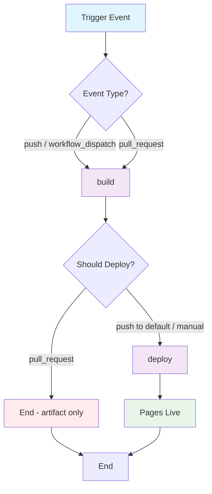

## Workflow Overview

**Purpose**: Build the `antd-theme-playground` static app and publish it to GitHub Pages for public theme preview.
**Trigger Events**: Push to default branch (path-filtered); manual dispatch; optional PR validation (build only, no deploy).
**Target Environments**: GitHub Pages (`github-pages` deployment environment).

## Execution Flow Diagram



## Jobs & Dependencies

| Job Name | Purpose                                                                      | Dependencies                            | Execution Context          |
| -------- | ---------------------------------------------------------------------------- | --------------------------------------- | -------------------------- |
| build    | Install monorepo deps, build playground static assets, upload Pages artifact | None                                    | Linux CI runner            |
| deploy   | Publish uploaded artifact to GitHub Pages                                    | build; only on deploy-eligible triggers | `github-pages` environment |

## Requirements Matrix

### Functional Requirements

| ID      | Requirement                                           | Priority | Acceptance Criteria                                                                          |
| ------- | ----------------------------------------------------- | -------- | -------------------------------------------------------------------------------------------- |
| REQ-001 | Build playground production bundle from monorepo      | High     | Static output produced under app dist directory; build exit code 0                           |
| REQ-002 | Resolve workspace theme package during build          | High     | Build succeeds with `@clawd-cook/antd-jojo-theme` linked from workspace                      |
| REQ-003 | Serve correctly under project Pages base path         | High     | Assets and client routes resolve at `https://<org>.github.io/<repo>/` (not site root)        |
| REQ-004 | Upload only deployable static files as Pages artifact | High     | Artifact contains built HTML/CSS/JS/static assets; no `node_modules` or sources              |
| REQ-005 | Deploy artifact to GitHub Pages on eligible triggers  | High     | Site URL available via deployment output; Pages shows latest successful deploy               |
| REQ-006 | Skip deploy on pull requests                          | High     | PR runs build (+ optional checks); no Pages mutation                                         |
| REQ-007 | Support manual redeploy                               | Medium   | `workflow_dispatch` rebuilds and deploys from selected ref                                   |
| REQ-008 | Path-filter irrelevant changes                        | Medium   | Workflow skips when neither playground, theme package, lockfile, nor workflow itself changed |

### Security Requirements

| ID      | Requirement                         | Implementation Constraint                                                          |
| ------- | ----------------------------------- | ---------------------------------------------------------------------------------- |
| SEC-001 | Least-privilege tokens              | Default: contents read; deploy job only: pages write + OIDC id-token write         |
| SEC-002 | Deploy only from trusted refs       | Deploy limited to default branch and/or protected `github-pages` environment rules |
| SEC-003 | No long-lived deploy keys           | Prefer built-in token + OIDC; no PAT stored for Pages publish                      |
| SEC-004 | Secrets not embedded in static site | Build must not inject private credentials into client bundle                       |

### Performance Requirements

| ID       | Metric                       | Target                            | Measurement Method           |
| -------- | ---------------------------- | --------------------------------- | ---------------------------- |
| PERF-001 | End-to-end workflow duration | ≤ 10 min typical                  | Actions run duration         |
| PERF-002 | Dependency install           | Cache hit when lockfile unchanged | Cache restore / install logs |
| PERF-003 | Artifact size                | Only production dist              | Artifact size in Actions UI  |

## Input/Output Contracts

### Inputs

```yaml
# Environment Variables / Build Inputs
NODE_VERSION: string # Purpose: runtime for install + build (≥ repo engines)
PACKAGE_MANAGER: string # Purpose: monorepo install + filtered playground build
BASE_PATH: string # Purpose: public asset/route prefix for project Pages URL
# Typical value for this repo: /antd-jojo-theme/

# Repository Triggers
paths:
  - apps/antd-theme-playground/**
  - packages/antd-jojo-theme/**
  - pnpm-lock.yaml # or equivalent lockfile
  - package.json
  - pnpm-workspace.yaml
  - .github/workflows/<this-workflow>.*
branches: [default branch]
events: [push, pull_request, workflow_dispatch]
```

### Outputs

```yaml
# Job Outputs
page_url: string # Description: published GitHub Pages URL
build_artifact: directory # Description: playground production static site (dist)
```

### Secrets & Variables

| Type     | Name                 | Purpose                                      | Scope                 |
| -------- | -------------------- | -------------------------------------------- | --------------------- |
| Token    | GITHUB_TOKEN         | Checkout + Pages deploy via OIDC             | Workflow (auto)       |
| Variable | BASE_PATH (optional) | Override asset/base path if site URL changes | Repository / Workflow |
| Secret   | —                    | None required for standard Pages deploy      | —                     |

## Execution Constraints

### Runtime Constraints

- **Timeout**: Job timeout ≤ 15 minutes each; workflow fail-fast on build failure
- **Concurrency**: One active Pages deployment group; cancel or queue in-progress runs for same group (prefer cancel in-progress for docs-site freshness)
- **Resource Limits**: Standard hosted runner; no special GPU/large runner required

### Environmental Constraints

- **Runner Requirements**: Linux x64; Node matching repo `engines.node` (≥ 22.18)
- **Package Manager**: Compatible with workspace protocol (`workspace:*`) and catalog deps
- **Network Access**: Registry access for dependency install; GitHub APIs for artifact upload/deploy
- **Permissions**:
  - Workflow default: `contents: read`
  - Deploy job: `pages: write`, `id-token: write`
- **Pages Source**: Repository Pages settings must use **GitHub Actions** as publish source (not branch/folder)

### Build Product Constraints

- **App path**: `apps/antd-theme-playground`
- **Theme dependency**: `packages/antd-jojo-theme` (workspace)
- **Artifact root**: playground production output directory (e.g. `apps/antd-theme-playground/dist`)
- **SPA routing**: If client-side routes exist, Pages must serve `index.html` for deep links (fallback / 404 handling as needed)

## Error Handling Strategy

| Error Type                                | Response                                         | Recovery Action                                                           |
| ----------------------------------------- | ------------------------------------------------ | ------------------------------------------------------------------------- |
| Dependency install failure                | Fail build; no deploy                            | Fix lockfile/registry; re-run                                             |
| Build failure                             | Fail workflow; retain logs                       | Fix compile/type errors; ensure base path config; re-run                  |
| Artifact upload failure                   | Fail before deploy                               | Retry run; check artifact size limits                                     |
| Deploy failure                            | Fail deploy job; keep last successful Pages site | Check Pages enabled + Actions source; permissions; environment protection |
| Concurrent deploy conflict                | Serialize via concurrency group                  | Latest eligible run wins                                                  |
| Wrong base path (blank site / 404 assets) | Site deploys but assets 404                      | Correct `BASE_PATH` / asset prefix; rebuild                               |

## Quality Gates

### Gate Definitions

| Gate                   | Criteria                                      | Bypass Conditions                                    |
| ---------------------- | --------------------------------------------- | ---------------------------------------------------- |
| Build Success          | Production build completes with exit 0        | None                                                 |
| Artifact Present       | Non-empty static artifact uploaded            | None                                                 |
| Deploy Eligibility     | Default-branch push or manual dispatch        | PR never deploys                                     |
| Environment Protection | Optional required reviewers on `github-pages` | Repo policy; not required for public docs by default |

> Note: Lint/test gates are out of scope for this workflow unless later linked as required checks. Prefer a separate CI workflow for quality; this workflow focuses on publish.

## Monitoring & Observability

### Key Metrics

- **Success Rate**: ≥ 95% of deploy-eligible runs succeed
- **Execution Time**: Track p50/p95 of build + deploy
- **Pages Freshness**: Time from merge to live URL

### Alerting

| Condition                                        | Severity | Notification Target                      |
| ------------------------------------------------ | -------- | ---------------------------------------- |
| Deploy job failed on default branch              | High     | Repo maintainers / Actions email         |
| Repeated build failures on path-filtered changes | Medium   | PR author + maintainers                  |
| Pages site returns asset 404 after deploy        | High     | Manual verify post-deploy; fix base path |

## Integration Points

### External Systems

| System              | Integration Type        | Data Exchange        | SLA Requirements                         |
| ------------------- | ----------------------- | -------------------- | ---------------------------------------- |
| GitHub Pages        | Deployment target       | Static site artifact | Standard Pages propagation               |
| npm/registry        | Dependency fetch        | Package tarballs     | Install must complete within job timeout |
| GitHub Environments | Protection + URL output | Deployment records   | Optional approval delay                  |

### Dependent Workflows

| Workflow                 | Relationship      | Trigger Mechanism                                                  |
| ------------------------ | ----------------- | ------------------------------------------------------------------ |
| Future CI (lint/test)    | Soft prerequisite | May gate merges; not required inside this workflow                 |
| Package release workflow | Independent       | Theme npm publish does not auto-trigger Pages unless paths overlap |

## Compliance & Governance

### Audit Requirements

- **Execution Logs**: Retained per GitHub Actions retention settings
- **Approval Gates**: Optional on `github-pages` environment
- **Change Control**: Spec updated before workflow behavior changes

### Security Controls

- **Access Control**: Only actors who can push to default branch (or pass environment rules) can cause production Pages updates
- **Secret Management**: No deploy secrets; rotate only if custom tokens are later introduced
- **Vulnerability Scanning**: Not in-scope for this workflow; rely on separate dependency/CI scanning if present

## Edge Cases & Exceptions

### Scenario Matrix

| Scenario                                  | Expected Behavior                                                      | Validation Method                      |
| ----------------------------------------- | ---------------------------------------------------------------------- | -------------------------------------- |
| Change only in `packages/antd-jojo-theme` | Rebuild + redeploy playground                                          | Path filter includes theme package     |
| Change only in unrelated docs/tools       | Workflow does not run                                                  | Path filter excludes                   |
| PR against default branch                 | Build (+ upload optional); no Pages deploy                             | Deploy job skipped / conditioned false |
| Manual dispatch on feature branch         | Build always; deploy only if policy allows (default: deny non-default) | Environment / `if` condition           |
| Empty dist after build                    | Fail upload / fail job                                                 | Assert dist non-empty                  |
| Repo renamed / org pages vs project pages | Update `BASE_PATH` and re-deploy                                       | Smoke-test asset URLs                  |
| Concurrent pushes to default branch       | Single deploy in flight; prefer newest                                 | Concurrency group behavior             |

## Validation Criteria

### Workflow Validation

- **VLD-001**: Push to default branch touching playground sources produces a successful Pages deployment
- **VLD-002**: Published URL loads playground UI and theme preview without missing assets
- **VLD-003**: PR touching same paths runs build without changing live Pages content
- **VLD-004**: Manual dispatch from default branch redeploys successfully
- **VLD-005**: Workspace theme package changes are reflected in the deployed playground after merge

### Performance Benchmarks

- **PERF-001**: Cold run (no cache) completes within timeout
- **PERF-002**: Warm run (cache hit) typically under 10 minutes

## Change Management

### Update Process

1. **Specification Update**: Modify this document first
2. **Review & Approval**: Maintainer review of spec diff
3. **Implementation**: Apply equivalent behavior to workflow + any required app base-path config
4. **Testing**: Manual dispatch + PR dry-run; verify live URL
5. **Deployment**: Merge to default branch; confirm Pages settings use Actions source

### Version History

| Version | Date       | Changes                                             | Author      |
| ------- | ---------- | --------------------------------------------------- | ----------- |
| 1.0     | 2026-09-23 | Initial specification for playground → GitHub Pages | DevOps Team |

## Related Specifications

- App: `apps/antd-theme-playground` (Rsbuild static playground)
- Theme package: `packages/antd-jojo-theme`
- Repo engines: Node ≥ 22.18; pnpm workspace + catalog
- GitHub docs: Pages custom workflows (Actions as source); `github-pages` environment

## Implementation Notes (Non-Normative)

Behavior expectations for implementers — not binding syntax:

1. Two-phase job model: **build** → upload Pages artifact → **deploy** (needs build).
2. Configure public base/asset prefix to repository project Pages path (`/<repo>/`).
3. Build command should target playground package within monorepo (root filtered build is acceptable).
4. Enable repository Pages → Source: **GitHub Actions** before first deploy.
5. Prefer concurrency group named for Pages deploys to avoid overlapping publishes.
